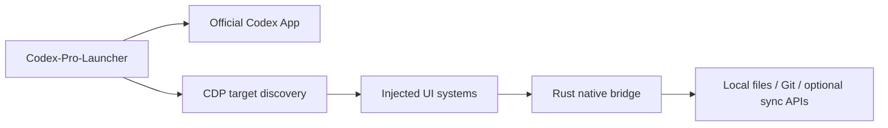

<div align="center">
  

  # Codex-Pro-Launcher

  **External launcher and workflow enhancer for Codex Desktop**

  <sub>给 Codex 桌面端使用的外部增强启动器与工作流扩展</sub>

  <br />

  <sub><a href="README_CN.md">中文</a> | English | <a href="README_JA.md">日本語</a></sub>

  <br />
  <br />

  
  
  
  
</div>

---

Codex-Pro-Launcher is an external enhancement launcher for Codex App. It does not modify the original Codex App installation files and does not repackage the official Codex App. Instead, it starts or reuses the official Codex App through an independent Rust launcher, injects enhancement modules through Chromium DevTools Protocol, and handles local capabilities through a Rust native bridge.

Its goal is not to replace Codex App or modify the original Codex App installation files. It keeps the official client experience intact while filling in high-frequency workflow gaps that interrupt daily development.

https://github.com/user-attachments/assets/ea5e3733-dc0d-4ed2-8222-363b3f830d75

## ⚡ Quick Start

1. Download the latest version from [GitHub Releases](https://github.com/FcsVorfeed/Codex-Pro-Launcher/releases).
2. Extract it, then double-click `Codex-Pro-Launcher.exe`.
3. That's all.

Before launching, close the official Codex client. Start Codex through Codex-Pro-Launcher after that.

If you want the stock Codex experience, launch the official Codex client directly.

## 💬 Community

Join the community channels to discuss usage, report issues, or suggest new features:

- Discord: <https://discord.gg/QQ43rEd88Q>
- QQ group: `104016126`

## 🌿 Design Philosophy

The starting point is simple: Codex is already part of daily work, and I do not want an extra tool to become another thing to manage. Codex-Pro-Launcher is meant to feel like a quiet layer around the existing workflow. Most of the time it stays out of the way; when you need usage context, latency signals, conversation history, or a way to continue work on another machine, the information is already close at hand.

🫧 **Quiet by default.**  
It stays close to the original Codex App interaction model and places enhancements where users already expect to look. If you want the stock experience, launch Codex App normally; Codex-Pro-Launcher does not leave irreversible changes behind.

📊 **Less guessing around usage.**  
5-hour / weekly usage, current conversation context, input and output tokens, and network latency are shown compactly inside existing surfaces. This makes it easier to anticipate when context compression may happen and to tell whether a slowdown comes from network latency or model response time.

☁️ **Multi-device sync without touching the originals.**  
I use Codex across multiple machines, and scattered conversations quickly become painful when work needs to continue from a different device. Codex-Pro-Launcher sync works through export, encryption, packaging, and preview rather than rewriting the original Codex conversation data or damaging local originals.

🎮 **Built by a game designer for a real workflow.**  
I am a game designer with nearly two decades of experience, and making games is my biggest personal passion. Codex-Pro-Launcher grew naturally out of my daily Codex use. Revenue from license codes first helps cover remote sync server and storage costs, and also supports my continued work on game projects and long-term maintenance of this tool.

## 🧩 Feature Preview

### The pet now supports custom sound effects!

https://github.com/user-attachments/assets/206dc63c-c403-49fb-a37c-5186894a3a3c

### 📊 Clearer Usage and Context


Codex-Pro-Launcher places remaining usage, today's tokens, current conversation tokens, network latency, and context usage where they are easier to scan. It does not store raw conversation content just to show usage statistics.

### 🔍 Smoother Change Review


https://github.com/user-attachments/assets/d092fb5f-f7c8-4b63-9e3b-228b632f34b6

Hover over Codex's native change summaries to see the changed file list. You can open a single-file preview, jump to a specific hunk, or send the file pair to a local external diff tool.

### 🌳 Less Noisy File Tree


https://github.com/user-attachments/assets/ab7871c8-d550-4b09-b2e2-ba4be628ac65

Hide build output, cache folders, and other noisy entries by rule. When the right-side preview changes, the file tree can also reveal the folder that contains the active file.

### 🖱️ Faster Mouse Gestures


Codex-Pro-Launcher can bind common actions to controlled mouse gestures and shortcut requests, reducing repeated movement between windows, panels, and review surfaces.

### 🧲 More Natural Drag and Drop


Right-side file tabs and left-side conversation rows can be dragged directly into the chat composer. Codex-Pro-Launcher reuses Codex's native attachment path where possible instead of simulating files through fragile text insertion.

### 🖼️ More Immersive Background Carousel


Background images support multiple entries, random playback, opacity, size, and position controls. Switching uses a two-layer fade transition, and DOM nodes and timers are cleaned up when disabled or reinjected.

### ☁️ More Controlled Conversation Sync


Conversation archive sync exports, encrypts, packages, and syncs conversations according to the user's configuration while keeping local preview support. The public repository keeps the client implementation and public documentation.

### 🔄 More Complete Multi-Device Workflow

Settings, pet resources, and conversation archives are optional sync capabilities. Sync features require a user-configured connection, and the public client source keeps that boundary explicit.

## ✨ Highlights

| Capability | What it solves | Status |
| --- | --- | --- |
| 🚀 External launcher | Starts, reuses, and brings Codex to the front, then repairs injection when needed | Implemented |
| 🧠 Rust native bridge | Lets injected UI modules request controlled local capabilities without shipping Node / .NET runtime | Implemented |
| 📊 Usage and context display | Shows 5-hour / weekly usage, today's tokens, current conversation tokens, and context usage at a glance | Implemented |
| 🔍 Diff hover preview | Quickly reviews changed files, jumps into single-file preview, or opens an external diff tool | Implemented |
| 🌳 File tree enhancements | Hides noisy files, reveals the active preview file, and drags right-side file tabs into chat | Implemented |
| 🖱️ Mouse gestures | Turns middle-click, shortcuts, and gestures into faster in-window operations | Implemented |
| 🖼️ Background carousel | Rotates multiple background images with fade transitions and lightweight personalization | Implemented |
| 🧲 Advanced drag and drop | Drags right-side file tabs or left-side conversation rows into the chat composer | Implemented |
| ☁️ Conversation sync | Syncs archived conversations to a user-configured remote endpoint for multi-device viewing and backup | Implemented |
| ⚙️ Settings center | Organizes feature switches, behavior, appearance, and sync options by module | Implemented |
| 🎨 Appearance tweaks | Adds background images, font overrides, startup sidebar behavior, and other experience refinements | Implemented |
| 🔄 Settings / pet / conversation archive sync | Syncs multi-device workflow state after the user configures the connection | Implemented |

## 🛡️ Architecture Boundary

Codex-Pro-Launcher uses an external enhancement model:



- Does not modify the original Codex App installation files.
- Does not repackage the official Codex App.
- Keeps the client implementation publicly reviewable except for private materials and internal configuration.
- Injected page modules can request local capabilities only through the controlled native bridge.

## 🗂️ Project Structure

```text
apps/codex-pro-launcher/        Rust launcher entry point
crates/codex-pro-core/          Launch, CDP, injection, and diagnostics core
crates/codex-pro-bridge/        Rust native bridge and local capability handlers
src/inject/core/                Injected runtime, lifecycle, i18n, DOM, and bridge wrappers
src/inject/systems/             Feature modules
scripts/                        Build, injection, and check scripts
asset/                          Public brand images and visual assets
private/                        Local private materials, not committed
```

The detailed module index is maintained privately by local maintainers because it may include internal notes that are not part of the public repository.

## 🌐 Public Scope

The Codex-Pro-Launcher public repository is used to present and review the client implementation, scripts, public documentation, and sample data. Private materials, internal configuration, deployment notes, and release process notes are not part of the public repository.

When filing an issue, prefer sanitized logs, screenshots, and reproduction steps.

## ❓ FAQ

### Does Codex-Pro-Launcher modify the original Codex App installation files?

No. Codex-Pro-Launcher starts or reuses Codex App through an external launcher, then injects enhancement scripts through CDP. It does not write to the Codex App installation directory and does not modify the original Codex App installation files.

### Why does it need a native bridge?

The Codex page should not gain arbitrary access to the local machine. The native bridge exposes controlled requests, such as Git change summaries, external diff actions, sync requests, and conversation archive previews, so the protocol and permission boundary stay explicit.

### What does the public repository include?

The public repository mainly contains client source code, build scripts, and public docs. Private or internal process materials are managed separately without blocking review of the client implementation.

### Will it keep working after Codex updates?

Codex-Pro-Launcher depends on Codex App page structure and discoverable official runtime entry points. If Codex App changes its page structure, some injected modules may need updates.

## Development

```powershell
npm run launch
npm run doctor
npm run inject
npm run check
npm run release:version
npm run release:version -- --version 1.0.0
npm run build:rust
```

The release build writes `private/build/rust/Codex-Pro-Launcher.exe` as the fixed local artifact and `private/build/rust/Codex-Pro-Launcher-vX.Y.Z-windows.zip` as the GitHub Release upload asset. Do not upload the standalone `.exe` as a release asset.

For local development, install the public-boundary Git hooks once per clone:

```powershell
.\scripts\install-git-hooks.ps1
```

The hooks block local-only materials such as `private/`, environment files, key files, archives, installers, and the private root module index from being committed or pushed.

New features should live in their own system directory:

```text
src/inject/systems/<system-name>/
```

Then update the related check scripts, i18n catalog, and the private module index maintained by local maintainers.

## Notice

Codex-Pro-Launcher is a third-party external enhancement project. It is not affiliated with OpenAI and is not part of the official Codex App client. Use it with an understanding of the maintenance and privacy boundaries of external injection tools.

The public client source code is released under the MIT License. Optional hosted sync, storage, license-code, or other server-side services are separate services and may require their own authorization or payment; the MIT License for this repository does not grant free access to those hosted services.
