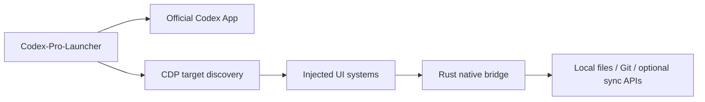

<div align="center">
  

  # Codex-Pro-Launcher

  **给 Codex 桌面端使用的外部增强启动器与工作流扩展**

  <sub>External launcher and workflow enhancer for Codex Desktop</sub>

  <br />

  <sub>中文 | <a href="README.md">English</a> | <a href="README_JA.md">日本語</a></sub>

  <br />
  <br />

  
  
  
  
</div>

---

Codex-Pro-Launcher 是一个面向 Codex App 的外部增强启动器。它不修改 Codex App 原始安装文件，也不重新打包官方 Codex App，而是通过独立 Rust 启动器启动或复用官方 Codex，再使用 Chromium DevTools Protocol 注入增强模块，并通过 Rust native bridge 承接本机能力。

它的目标不是替换 Codex App，也不是修改 Codex App 原始安装文件，而是在保留官方客户端体验的前提下，把日常开发中高频、重复、容易打断心流的操作补齐。

## 🌿 设计理念

我做这个项目的出发点很简单：Codex 已经是每天工作的一部分，我不希望额外工具变成新的负担。Codex-Pro-Launcher 应该像一层安静的增强，平时不抢注意力，只在你需要看清用量、判断延迟、整理对话或换一台设备继续工作时，刚好把信息放在手边。

🫧 **尽量无感。** 它贴着 Codex App 原有交互走，把增强能力放进你已经熟悉的位置。需要回到原版体验时，直接从官方 Codex App 启动即可，不会留下不可逆影响。

📊 **让用量不再靠猜。** 5 小时 / 每周用量、当前对话上下文、输入输出 token 和网络延迟都用紧凑方式展示在现有面板里。你能更早判断上下文大概什么时候可能压缩，也更容易分清当前卡顿到底来自网络延迟，还是模型本身的响应时间。

☁️ **多设备同步，但不碰原始数据。** 我自己在多台电脑上用 Codex 时，经常遇到对话和归档分散在不同设备上的问题，这很影响连续工作。Codex-Pro-Launcher 的对话同步采用导出、加密、打包和预览的方式工作，不改写 Codex 原始对话数据，也不破坏本机原件。

🎮 **这也是一个游戏设计师自己的工具。** 我是一个接近二十年的游戏设计师，制作游戏也是我最大的爱好。Codex-Pro-Launcher 是我在日常使用 Codex 时自然长出来的工具；授权码收入会优先用于覆盖远端同步的服务器和存储成本，也会支持我继续投入游戏项目，以及这个工具本身的长期维护。

## ✨ 核心特点

| 能力 | 解决的问题 | 当前状态 |
| --- | --- | --- |
| 🚀 外部启动器 | 启动、复用、置前 Codex，并自动补注入增强模块 | 已实现 |
| 🧠 Rust native bridge | 让页面增强模块安全请求受控本机能力，不依赖 Node / .NET runtime 发布 | 已实现 |
| 📊 用量与上下文显示 | 更直观看 5 小时 / 1 周用量、今日 token、当前会话 token 与上下文占用 | 已实现 |
| 🔍 Diff 悬浮预览 | 在文件变更摘要处快速查看变更文件、跳转单文件预览或外部 Diff | 已实现 |
| 🌳 文件树增强 | 隐藏噪音文件、自动定位当前预览文件、把右侧文件标签拖入聊天 | 已实现 |
| 🖱️ 鼠标手势 | 用中键、组合键和手势把常用动作变成更快的窗口内操作 | 已实现 |
| 🖼️ 背景轮播 | 支持多张背景图按间隔淡入淡出切换，给 Codex 工作区增加轻量个性化 | 已实现 |
| 🧲 高级拖拽 | 把右侧文件标签或左侧会话行拖入聊天输入区，减少手动选择 | 已实现 |
| ☁️ 对话同步 | 将会话归档同步到用户配置的远端，便于多设备查看和备份 | 已实现 |
| ⚙️ 设置中心 | 按功能分区管理开关、行为、外观和同步配置 | 已实现 |
| 🎨 个性化外观 | 背景图、字体覆盖、启动侧栏等 Codex 使用体验微调 | 已实现 |
| 🔄 设置 / 宠物 / 会话归档同步 | 在用户主动配置后同步多设备工作流状态 | 已实现 |

## ⚡ 快速使用

> 当前仓库公开区用于展示和审查客户端源码；隐私资料、内部配置和发布流程资料不放在公开仓库。

在本地开发环境中，如果已经有私有构建产物，可以双击：

```powershell
private/bin/Codex-Pro-Launcher.exe
```

或者在仓库根目录运行：

```powershell
npm run launch
```

刷新当前 Codex 窗口里的注入源码：

```powershell
npm run inject
```

运行完整检查：

```powershell
npm run check
```

构建正式 Rust 单文件发布包：

```powershell
npm run build:rust
```

## 🧩 功能预览

### 📊 更清晰的用量与上下文

Codex-Pro-Launcher 会把剩余用量、今日 token、当前会话 token、网络延迟和上下文占用放到更容易扫一眼的位置。它不会为了显示统计而保存原始对话正文。

### 🔍 更顺手的文件变更审查

在 Codex 原生变更摘要上悬浮即可看到文件列表。你可以选择打开单文件预览、跳转到具体 hunk，或者把文件交给本机外部 Diff 工具。

### 🌳 更少干扰的文件树

可以按规则隐藏构建输出、缓存目录或其它噪音文件；右侧文件预览切换时，也可以自动展开到当前文件所在目录。

### 🖱️ 更快的鼠标手势

Codex-Pro-Launcher 可以把常用动作绑定到受控鼠标手势和快捷键请求上，减少在窗口、面板和文件审查之间反复移动的打断。

### 🧲 更自然的高级拖拽

右侧文件标签和左侧会话行可以直接拖入聊天输入区，Codex-Pro-Launcher 会尽量复用 Codex 官方附件管线，而不是用脆弱的文本拼接模拟文件。

### 🖼️ 更沉浸的背景轮播

背景图支持多图轮播、随机播放、透明度、尺寸和位置配置。切换时使用双层背景淡入淡出，关闭或重新注入时会清理 DOM 和定时器。

### ☁️ 更可控的对话同步

会话归档同步会按用户配置把会话导出、加密、打包并同步到远端，同时保留本机预览能力。公开仓库只保留客户端实现和公开说明。

### 🔄 更完整的跨设备体验

设置、宠物资源和会话归档同步是可选能力。同步类功能需要用户主动配置同步连接，客户端公开源码只描述通用实现边界。

## 🛡️ 架构边界

Codex-Pro-Launcher 采用外部增强模式：



- 不修改 Codex App 原始安装文件。
- 不重新打包官方 Codex App。
- 除隐私资料和内部配置外，客户端实现尽量保持公开可审查。
- 页面增强模块只能通过受控 native bridge 请求本机能力，不能随意执行命令。

## 🗂️ 项目结构

```text
apps/codex-pro-launcher/        Rust 启动器入口
crates/codex-pro-core/          启动、CDP、注入和诊断核心
crates/codex-pro-bridge/        Rust native bridge 与本机能力 handler
src/inject/core/                注入运行时、生命周期、i18n、DOM 和 bridge 封装
src/inject/systems/             各功能模块
scripts/                        构建、注入和检查脚本
asset/                          公开品牌图与可公开视觉资源
private/                        本机私有资料，不提交
```

详细模块索引由本地维护者在私有文档中维护，因为其中可能包含不属于公开仓库的内部说明。

## 🌐 公开范围

Codex-Pro-Launcher 的公开仓库用于展示和审查客户端实现、脚本、公开说明和示例数据。隐私资料、内部配置、部署记录和发布流程资料不属于公开仓库。

如果你提交 issue，请尽量使用脱敏后的日志、截图和复现步骤。

## ❓ 常见问题

### Codex-Pro-Launcher 会修改 Codex App 原始安装文件吗？

不会。Codex-Pro-Launcher 通过外部 launcher 启动或复用 Codex App，并通过 CDP 注入增强脚本，不写入 Codex App 安装目录，也不修改 Codex App 原始安装文件。

### 为什么需要 native bridge？

Codex 页面本身不应该直接拥有任意本机能力。native bridge 只暴露受控请求，例如 Git 变更摘要、外部 Diff、同步请求、会话归档预览等，便于做权限边界和协议校验。

### 公开仓库包含哪些内容？

公开仓库主要包含客户端源码、构建脚本和公开文档。涉及隐私或内部流程的资料会单独管理，不影响客户端实现的公开审查。

### Codex 更新后还可用吗？

Codex-Pro-Launcher 依赖 Codex App 页面结构和可发现的官方运行态入口。Codex App 更新后，如果页面结构变化，部分注入模块可能需要适配。

## 开发

```powershell
npm run doctor
npm run inject
npm run check
npm run build:rust
```

本地开发时，每次新 clone 后先安装公开边界 Git hooks：

```powershell
.\scripts\install-git-hooks.ps1
```

这些 hooks 会拦截 `private/`、环境文件、密钥文件、压缩包、安装包和私有根模块索引，避免它们被提交或推送到公开主仓库。

新增功能优先放入独立目录：

```text
src/inject/systems/<system-name>/
```

并同步更新对应检查脚本、国际化字典和本地维护者私有模块索引。

## 说明

Codex-Pro-Launcher 是第三方外部增强项目，不隶属于 OpenAI，也不是 Codex App 官方客户端的一部分。使用前请确认你理解外部注入工具的维护边界和隐私边界。

公开客户端源码使用 MIT License 发布。可选的托管同步、存储、授权码或其它服务端能力属于独立服务，可能需要单独授权或付费；本仓库的 MIT License 不代表免费提供这些托管服务。
