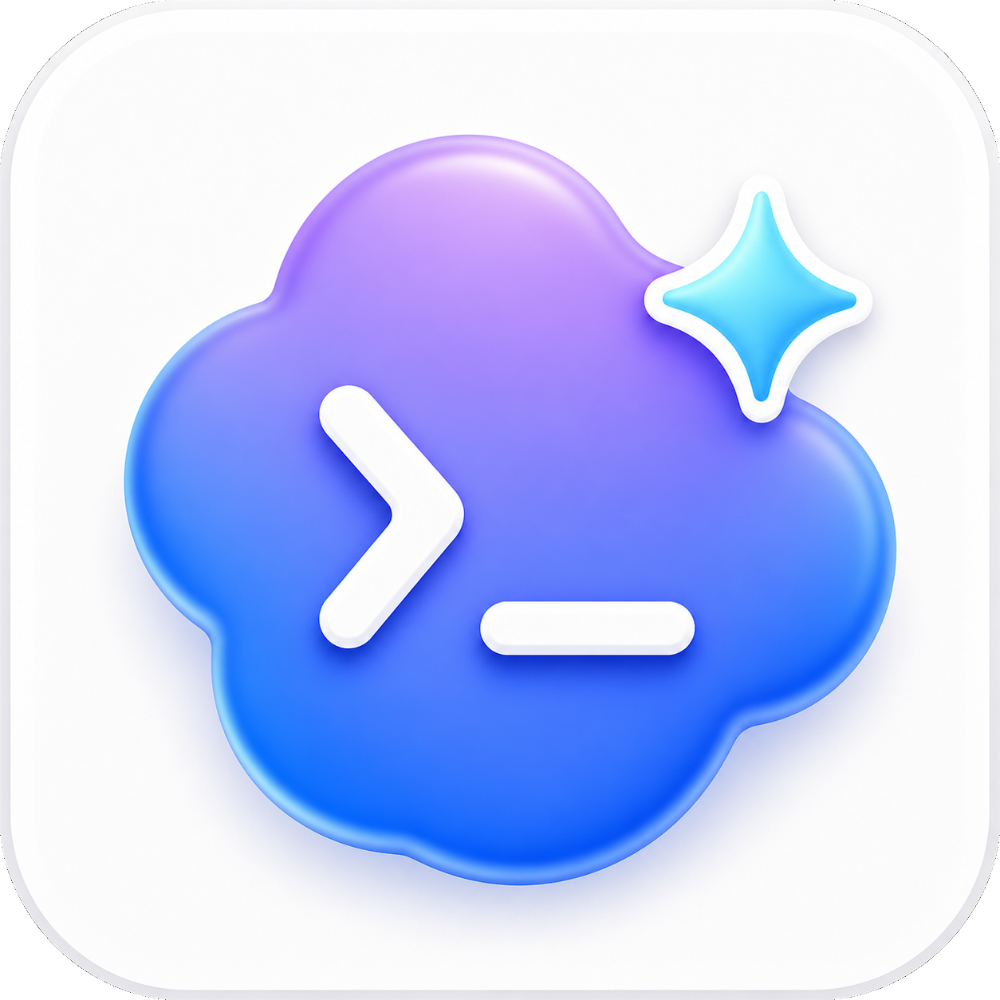
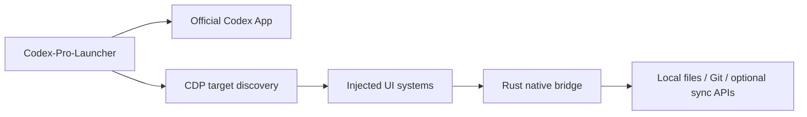

<div align="center">
  

  # Codex-Pro-Launcher

  **Codex Desktop のための外部ランチャー兼ワークフロー拡張**

  <sub>给 Codex 桌面端使用的外部增强启动器与工作流扩展</sub>

  <br />

  <sub><a href="README_CN.md">中文</a> | <a href="README.md">English</a> | 日本語</sub>

  <br />
  <br />

  
  
  
  
</div>

---

Codex-Pro-Launcher は、Codex App のための外部拡張ランチャーです。Codex App の元のインストールファイルは変更せず、公式 Codex App を再パッケージすることもありません。独立した Rust ランチャーで公式 Codex App を起動または再利用し、Chromium DevTools Protocol 経由で拡張モジュールを注入し、ローカル機能は Rust native bridge で扱います。

目的は Codex App を置き換えることではありません。公式クライアントの体験を保ったまま、日々の開発で何度も気になる小さな不便や、集中を切らしやすい作業を補うことです。

https://github.com/user-attachments/assets/ea5e3733-dc0d-4ed2-8222-363b3f830d75

## ⚡ クイックスタート

[GitHub Releases](https://github.com/FcsVorfeed/Codex-Pro-Launcher/releases) から最新の Windows リリースファイルをダウンロードします。

- Windows: `Codex-Pro-Launcher-vX.Y.Z-windows.zip`

起動する前に、公式 Codex Desktop をインストールしてサインインしておいてください。

ZIP を展開し、その中の `Codex-Pro-Launcher.exe` をダブルクリックします。Codex-Pro-Launcher は公式 Codex App を起動または再利用し、前面に表示して、CDP 経由で拡張モジュールを注入します。

素の Codex 体験に戻したい場合は、公式 Codex App を直接起動してください。Codex-Pro-Launcher は Codex を置き換えず、Codex のインストールファイルも変更しません。

ローカル開発、チェック、リリースビルドのコマンドは、下の[開発](#開発)を参照してください。

## 💬 コミュニティ

使い方の相談、不具合報告、新機能の提案は、次のコミュニティチャンネルで受け付けています。

- Discord: <https://discord.gg/QQ43rEd88Q>
- QQ グループ: `104016126`

## 🌿 設計思想

出発点はとてもシンプルです。Codex はすでに毎日の作業の一部なので、追加ツールが新しい負担になってほしくありません。Codex-Pro-Launcher は、既存のワークフローのまわりにある静かなレイヤーのような存在を目指しています。普段は前に出ず、使用量、遅延、会話履歴、別のPCで作業を続けたい場面で、必要な情報が自然に手元にある状態を目指します。

🫧 **できるだけ存在を意識させない。** Codex App 本来の操作感に寄り添い、ユーザーがすでに見慣れている場所に拡張機能を置きます。素の体験に戻したいときは、通常どおり公式 Codex App を起動すればよく、不可逆な変更は残しません。

📊 **使用量を勘で見ない。** 5時間 / 週ごとの使用量、現在の会話コンテキスト、入力・出力 token、ネットワーク遅延を既存の画面にコンパクトに表示します。コンテキスト圧縮が近いかどうか、遅さの原因がネットワークなのかモデル応答なのかを判断しやすくします。

☁️ **複数デバイス同期でも、元データには触れない。** 私自身、複数のPCで Codex を使っていると、会話やアーカイブが端末ごとに散らばってしまい、作業を続けるときにかなり不便でした。Codex-Pro-Launcher の同期は、エクスポート、暗号化、パッケージ化、プレビューという流れで動作し、Codex の元の会話データを書き換えたり、ローカルの原本を壊したりしません。

🎮 **実際のワークフローから生まれた、ゲームデザイナー自身のツール。** 私は、ゲームデザイナーとしてもうすぐ20年になります。ゲームを作ることは、今でも私にとっていちばん大きな情熱です。Codex-Pro-Launcher は、私が日常的に Codex を使う中で自然に生まれたツールです。ライセンスコードの収益は、まずリモート同期のサーバーとストレージ費用に充てられ、同時にゲーム制作とこのツールの長期的なメンテナンスを支える力にもなります。

## 🧩 機能プレビュー

### 📊 使用量とコンテキストを見やすく


Codex-Pro-Launcher は、残り使用量、今日の token、現在の会話 token、ネットワーク遅延、コンテキスト使用量を見やすい位置に表示します。統計表示のために元の会話本文を保存することはありません。

### 🔍 変更レビューをよりスムーズに


Codex 標準の変更サマリーにホバーすると、変更されたファイル一覧を確認できます。単一ファイルプレビューを開いたり、特定の hunk へ移動したり、ローカルの外部 Diff ツールへ渡したりできます。

### 🌳 ファイルツリーのノイズを減らす


ビルド出力、キャッシュフォルダ、その他のノイズになる項目をルールで隠せます。右側プレビューが切り替わると、現在のファイルを含むフォルダも見つけやすくなります。

### 🖱️ マウスジェスチャーで素早く操作


よく使う操作を、制御されたマウスジェスチャーやショートカット要求に割り当て、ウィンドウやパネル間の行き来を減らします。

### 🧲 より自然なドラッグ&ドロップ


右側ファイルタブや左側会話行を、そのままチャット composer へドラッグできます。可能な限り Codex 標準の添付フローを再利用し、壊れやすいテキスト挿入でファイルを真似ることはしません。

### 🖼️ 背景ローテーションで少しだけ没入感を追加


複数背景、ランダム再生、透明度、サイズ、位置を設定できます。切り替えは2レイヤーのフェードで行い、無効化や再注入時には DOM とタイマーを片付けます。

### ☁️ 会話同期をより制御しやすく


会話アーカイブ同期は、ユーザー設定に従って会話をエクスポート、暗号化、パッケージ化、同期し、ローカルプレビューも維持します。公開リポジトリにはクライアント実装と公開ドキュメントを置きます。

### 🔄 複数デバイスの作業をつなげる

設定、ペットリソース、会話アーカイブの同期は任意機能です。同期機能にはユーザー設定の接続が必要であり、公開クライアント側のソースコードではその境界を明確にしています。

## ✨ 主な特徴

| 機能 | 解決したいこと | 状態 |
| --- | --- | --- |
| 🚀 外部ランチャー | Codex を起動、再利用、前面表示し、必要に応じて注入状態を補修 | 実装済み |
| 🧠 Rust native bridge | Node / .NET runtime を同梱せず、注入UIから制御されたローカル機能を安全に呼び出す | 実装済み |
| 📊 使用量とコンテキスト表示 | 5時間 / 週ごとの使用量、今日の token、現在の会話 token、コンテキスト使用量を見やすく表示 | 実装済み |
| 🔍 Diff ホバープレビュー | 変更ファイルを素早く確認し、単一ファイルプレビューや外部 Diff ツールへ移動 | 実装済み |
| 🌳 ファイルツリー拡張 | ノイズになるファイルを隠し、現在のプレビューファイルを見つけやすくし、右側タブをチャットへドラッグ | 実装済み |
| 🖱️ マウスジェスチャー | 中クリック、ショートカット、ジェスチャーをより速いウィンドウ内操作へ変換 | 実装済み |
| 🖼️ 背景ローテーション | 複数背景をフェードで切り替え、軽いパーソナライズを追加 | 実装済み |
| 🧲 高度なドラッグ&ドロップ | 右側ファイルタブや左側会話行をチャット composer にドラッグ | 実装済み |
| ☁️ 会話同期 | アーカイブ済み会話をユーザー設定のリモートへ同期し、複数デバイスで確認・バックアップ | 実装済み |
| ⚙️ 設定センター | 機能スイッチ、挙動、外観、同期設定をモジュールごとに整理 | 実装済み |
| 🎨 外観調整 | 背景、フォント上書き、起動時サイドバーなどの体験を微調整 | 実装済み |
| 🔄 設定 / ペット / 会話アーカイブ同期 | ユーザーが接続を設定した後、複数デバイスの作業状態を同期 | 実装済み |

## 🛡️ アーキテクチャ上の境界

Codex-Pro-Launcher は外部拡張モデルを採用しています。



- Codex App の元のインストールファイルを変更しません。
- 公式 Codex App を再パッケージしません。
- 個人情報や内部設定を除き、クライアント実装は公開レビューしやすい状態を保ちます。
- 注入ページ側のモジュールは、制御された native bridge を通してのみローカル機能を要求できます。

## 🗂️ プロジェクト構成

```text
apps/codex-pro-launcher/        Rust ランチャー入口
crates/codex-pro-core/          起動、CDP、注入、診断のコア
crates/codex-pro-bridge/        Rust native bridge とローカル機能 handler
src/inject/core/                注入 runtime、lifecycle、i18n、DOM、bridge wrapper
src/inject/systems/             機能モジュール
scripts/                        ビルド、注入、チェック用スクリプト
asset/                          公開ブランド画像とビジュアル素材
private/                        ローカル private 資料、コミットしない
```

詳細なモジュール索引は、公開リポジトリに含めない内部メモを含む可能性があるため、ローカルメンテナーが private 文書として管理します。

## 🌐 公開範囲

Codex-Pro-Launcher の公開リポジトリは、クライアント実装、スクリプト、公開ドキュメント、サンプルデータを提示し、レビューできるようにするためのものです。個人情報、内部設定、デプロイ記録、リリース手順に関する資料は公開リポジトリには含めません。

issue を作成する場合は、できるだけマスキング済みのログ、スクリーンショット、再現手順を使ってください。

## ❓ FAQ

### Codex-Pro-Launcher は Codex App の元のインストールファイルを変更しますか？

いいえ。Codex-Pro-Launcher は外部ランチャーとして Codex App を起動または再利用し、CDP 経由で拡張スクリプトを注入します。Codex App のインストールディレクトリへ書き込まず、元のインストールファイルも変更しません。

### なぜ native bridge が必要なのですか？

Codex ページがローカルマシンへ任意にアクセスできる状態にするべきではありません。native bridge は Git 変更サマリー、外部 Diff、同期要求、会話アーカイブプレビューなどの制御された要求だけを公開し、プロトコルと権限境界を明確にします。

### 公開リポジトリには何が含まれますか？

主にクライアントソースコード、ビルドスクリプト、公開ドキュメントが含まれます。個人情報や内部プロセスに関わる資料は別に管理します。

### Codex が更新された後も使えますか？

Codex-Pro-Launcher は Codex App のページ構造と、発見可能な公式 runtime entry point に依存します。Codex App 側の構造が変わった場合、一部の注入モジュールは調整が必要になることがあります。

## 開発

```powershell
npm run launch
npm run doctor
npm run inject
npm run check
npm run release:version
npm run release:version -- --version 1.0.0
npm run build:rust
```

リリースビルド後は `private/build/rust/Codex-Pro-Launcher.exe` が固定のローカル成果物、`private/build/rust/Codex-Pro-Launcher-vX.Y.Z-windows.zip` が GitHub Release へアップロードする正式アセットになります。単独の `.exe` は Release アセットとしてアップロードしません。

ローカル開発では、新しい clone ごとに公開境界用の Git hooks を一度だけインストールしてください。

```powershell
.\scripts\install-git-hooks.ps1
```

これらの hooks は `private/`、環境ファイル、鍵ファイル、アーカイブ、インストーラー、private root module index が公開メインリポジトリへコミットまたは push されることを防ぎます。

新機能は、できるだけ独立した system ディレクトリに置きます。

```text
src/inject/systems/<system-name>/
```

あわせて関連するチェック用スクリプト、i18n catalog、ローカルメンテナーが管理する private module index も更新します。

## 注意

Codex-Pro-Launcher は第三者による外部拡張プロジェクトです。OpenAI とは提携しておらず、公式 Codex App クライアントの一部でもありません。外部注入ツールとしてのメンテナンス境界とプライバシー境界を理解したうえで使用してください。

公開されているクライアントソースコードは MIT License の下で提供されます。任意のホスト型同期、ストレージ、ライセンスコード、その他のサーバー側サービスは別サービスであり、個別の認可や支払いが必要になる場合があります。このリポジトリの MIT License は、それらのホスト型サービスを無料で利用できる権利を与えるものではありません。
